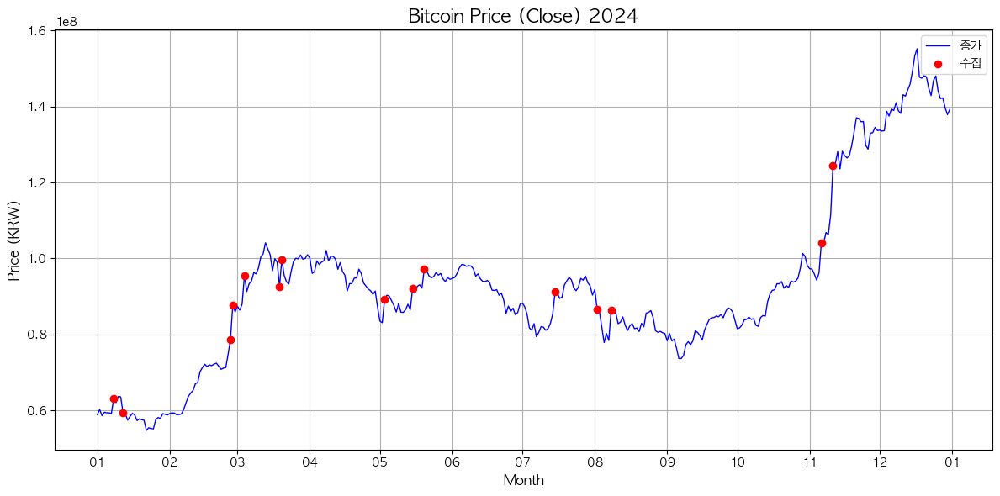

# 📊👨‍👩‍👦 DPAT Group Project  
**2025학년도 2학년 1학기 전공선택 - 데이터처리와분석기술 기말 프로젝트**

---

## ❓ 프로젝트 소개

이 프로젝트는 **비트코인 가격과 뉴스 키워드 간의 상관관계**를 분석하는 것을 목표로 합니다.  
특히, 비트코인의 **급격한 가격 변화 + 거래량 급증**이 나타나는 시점을 기준으로 뉴스 데이터를 수집하고, **중복 키워드 분석과 시각화**를 통해 패턴을 도출합니다.

> **연구 주제:**  
> _비트코인 가격과 뉴스(정치, 경제, 날씨 등) 속 키워드의 상관관계는 어떤가?_

---

## 🗂️ 폴더 구조

```
📁 src/
├── 📂 coin/   : 비트코인 데이터 수집, 필터링, 분석, 시각화
└── 📂 news/   : 뉴스 데이터 수집 및 키워드 정제/분석
└── 📂 Bot/   : 뉴스 데이터 기반 비트코인 자동매매 봇 (필수 x)
```

---

## 🔍 분석 절차

1. 📈 **비트코인 급등 + 거래량 증가 시점 식별**
   - 2024년 시세 기준, **등락률 5% 이상**인 날을 선정
   - 거래량도 함께 고려
   
   > 마커에 표시된 날짜의 뉴스 데이터를 수집

2. 📰 **해당 날짜 기준 뉴스 수집**
   - 카테고리: 정치 / 경제 / 날씨 등 다양하게 수집
   - Google Sheet의 IMPORTXML을 활용한 수집

3. 🧠 **중복 키워드 분석**
   - 정형화된 뉴스 데이터에서 반복되는 단어 추출

4. 🌥️ **시각화**
   - **워드 클라우드:** 빈도 기반 핵심 키워드 시각화  
   - **막대그래프:** 상위 키워드별 빈도 비교

5. 🤖 **추가 목표 (시간 여유 시)**
   - 주요 키워드를 활용한 **자동 매매 봇 설계**

---

## 🎯 기대 효과

- 뉴스 속 키워드가 비트코인 가격에 **미치는 영향** 파악
- 뉴스 기반 **트렌드 탐지 및 투자 전략 수립 가능성** 제시
- 데이터 분석 → 정형화 → 시각화 → 자동화까지 이어지는 **프로젝트 파이프라인 학습**

---

## 📅 진행 일정

> **기간:** 2025년 5월 ~ 6월
> **발표일:** 기말고사 기간 중

## 📷 뉴스 키워드 분석 결과

| 날짜          | 시각화 이미지                 |
|---------------|------------------------------|
| 1월 8일       |  |
| 1월 12일      |  |
| 2월 27일      |  |
| 2월 28일      |  |
| 3월 4일       |    |
| 3월 19일      |  |
| 3월 20일      |  |
| 5월 3일       |    |
| 5월 15일      |  |
| 5월 20일      |  |
| 7월 15일      |  |
| 8월 2일       |    |
| 8월 8일       |    |
| 11월 6일      |  |
| 11월 11일     | |